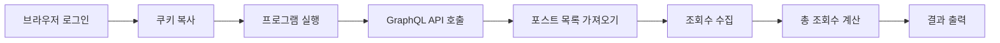

<div align="center">

# 📊 Velog 총 조회수 자동 수집 도구

**Velog 블로그의 모든 포스트 조회수를 자동으로 수집하여 총 조회수를 계산하는 Node.js 도구입니다.**


[설치](#-설치-방법) • [사용법](#-사용-방법) • [FAQ](#-자주-묻는-질문-faq) • [트러블슈팅](#-트러블슈팅)

---

</div>

## 📖 목차

<details>
<summary>클릭하여 펼치기</summary>

- [소개](#-소개)
- [주요 기능](#-주요-기능)
- [작동 방식](#-작동-방식)
- [사전 요구사항](#-사전-요구사항)
- [설치 방법](#-설치-방법)
- [사용 방법](#-사용-방법)
  - [1단계: 쿠키 가져오기](#1단계-쿠키-가져오기)
  - [2단계: 프로그램 실행](#2단계-프로그램-실행)
- [출력 예시](#-출력-예시)
- [자주 묻는 질문 (FAQ)](#-자주-묻는-질문-faq)
- [트러블슈팅](#-트러블슈팅)
- [주의사항](#-주의사항)
- [라이선스](#-라이선스)

</details>

---

<div align="center">

## 🎯 소개

이 도구는 Velog 블로그의 **모든 포스트 조회수를 자동으로 수집**하여 **총 조회수를 계산**해줍니다.  
수동으로 하나씩 확인할 필요 없이, 한 번의 실행으로 전체 블로그의 총 조회수를 확인할 수 있습니다.

</div>

---

## ✨ 주요 기능

<div align="center">

| 기능 | 설명 |
|:---:|:---|
| 🛡️ **안정성** | UI 변경에 강함 - GraphQL API 기반 |
| ⚡ **빠른 속도** | DOM 크롤링보다 훨씬 빠르고 안정적 |
| 🔧 **간편함** | GraphQL 쿼리만 관리하면 됨 |
| 🤖 **자동화** | 모든 포스트 자동 수집 및 합계 계산 |
| 📈 **실시간 표시** | 처리 중인 포스트 개수 실시간 표시 |

</div>

---

## 🔧 작동 방식

<div align="center">



</div>

1. **🍪 쿠키 기반 인증**: 일반 브라우저에서 Velog에 로그인한 후 인증 쿠키를 복사하여 사용합니다.
2. **🔌 GraphQL API 활용**: Velog의 GraphQL API를 통해 로그인 세션이 필요한 통계 데이터를 안정적으로 수집합니다.
3. **📦 배치 처리**: 모든 포스트를 순차적으로 가져와 조회수를 합산합니다.

---

## 📋 사전 요구사항

<div align="center">

| 항목 | 요구사항 |
|:---:|:---|
| **Node.js** | 버전 14 이상 |
| **Velog 계정** | 본인의 Velog 블로그 로그인 가능 |
| **웹 브라우저** | Chrome, Edge, Firefox 등 (개발자 도구 지원) |

</div>

> 💡 **Node.js 확인 방법**: 터미널에서 `node --version` 실행  
> 📥 **Node.js 다운로드**: [Node.js 공식 사이트](https://nodejs.org/)

---

## 💻 설치 방법

### 1️⃣ 프로젝트 다운로드/클론

```bash
git clone https://github.com/your-username/velog-total-views-tracker.git
cd velog-total-views-tracker
```

### 2️⃣ 의존성 설치

```bash
npm install
```

> 💡 **참고**: 이 프로젝트는 외부 의존성이 없어 설치가 빠르게 완료됩니다.

### 3️⃣ 설치 확인

```bash
node total-views.mjs
```

> ✅ 사용법 안내 메시지가 출력되면 설치가 완료된 것입니다.

---

## 🚀 사용 방법

### 1단계: 쿠키 가져오기

Velog에 로그인한 상태에서 브라우저의 개발자 도구를 사용해 인증 쿠키를 가져옵니다.

#### **⭐ 방법 1: GraphQL 요청에서 쿠키 가져오기 (가장 추천)**

<div align="center">

이 방법이 가장 정확하고 확실합니다.

</div>

| 단계 | 설명 |
|:---:|:---|
| **1** | Chrome 또는 Edge에서 [velog.io](https://velog.io) 접속 후 로그인 |
| **2** | `F12` 키 누르기 (또는 `Ctrl + Shift + I` / Mac: `Cmd + Option + I`) |
| **3** | 개발자 도구 상단의 **"Network"** 탭 클릭 |
| **4** | 필터 입력란에 `graphql` 입력 (또는 `v2cdn.velog.io` 입력) |
| **5** | 통계 페이지(`/stats`) 또는 포스트 목록 페이지 새로고침 (F5) |
| **6** | Network 탭에 나타난 `graphql` 요청 클릭 |
| **7** | **"Headers"** 탭 선택 → **"Request Headers"** 섹션으로 스크롤 |
| **8** | `cookie:` 헤더 찾기 → **전체 값을 복사** (전체 한 줄) |

<div align="center">


**쿠키 헤더 예시:**
```
cookie: access_token=eyJhbGciOiJIUzI1NiIsInR5cCI6IkpXVCJ9...; refresh_token=eyJ...; velog=...; ...
```

</div>

#### **방법 2: 일반 요청에서 쿠키 가져오기**

1. 브라우저에서 Velog 로그인
2. `F12` (개발자 도구) 열기
3. **Network 탭** 선택
4. Velog 페이지 새로고침 (F5)
5. velog.io 도메인의 아무 요청 클릭
6. **Headers 탭** → **Request Headers** → **`cookie:`** 헤더 복사

#### **방법 3: Application 탭에서 쿠키 가져오기**

1. 브라우저에서 Velog 로그인
2. `F12` (개발자 도구) 열기
3. **Application 탭** 클릭 (Chrome) / **Storage 탭** 클릭 (Firefox)
4. 왼쪽 메뉴에서 **Cookies** → **https://velog.io** 선택
5. 쿠키 목록에서 주요 쿠키들을 확인하고 다음 형식으로 합치기:

```
access_token=xxx; refresh_token=yyy; velog=zzz; ...
```

<div align="center">

⚠️ **중요**: 쿠키에 인증 정보(`access_token`, `refresh_token` 등)가 포함되어야 합니다.  
Network 탭의 `cookie:` 헤더를 복사하는 것이 가장 확실합니다.

</div>

---

### 2단계: 프로그램 실행

터미널(또는 명령 프롬프트)을 열고 다음 명령어를 실행합니다:

```bash
node total-views.mjs <velog_username>
```

**예시:**
```bash
node total-views.mjs myusername
```

<div align="center">

**실행 과정:**

| 단계 | 동작 |
|:---:|:---|
| 1 | 프로그램이 쿠키 입력을 요청 |
| 2 | 1단계에서 복사한 쿠키 문자열 붙여넣기 후 Enter |
| 3 | 프로그램이 자동으로 포스트 목록 수집 및 조회수 계산 |
| 4 | 결과가 화면에 출력 |

</div>

---

## 📊 출력 예시

<div align="center">

```
📋 일반 브라우저(Chrome/Edge 등)에서 Velog에 로그인한 후:

【방법 1 - 가장 추천】 GraphQL 요청에서 쿠키 가져오기:
1. F12 (개발자 도구) 열기
2. Network 탭 선택
3. 필터에 'graphql' 입력 (또는 'v2cdn.velog.io' 입력)
4. Velog 페이지에서 통계 페이지나 포스트 목록 새로고침
5. graphql 요청 클릭 → Headers 탭 → Request Headers
6. 'cookie:' 헤더의 전체 값을 복사 (전체 한 줄)

...

쿠키 문자열을 붙여넣어주세요:
[여기에 쿠키 붙여넣기 후 Enter]

📊 Fetching posts for @myusername...
Found 25 posts
진행 중... 25/25 포스트 처리됨

✅ @myusername TOTAL VIEWS = 12,345
```

</div>

---

## ❓ 자주 묻는 질문 (FAQ)

<details>
<summary><b>Q1. 쿠키가 만료되었는데 어떻게 하나요?</b></summary>

**A:** 쿠키는 일정 시간 후 만료됩니다. 만료되었다면:
1. 브라우저에서 Velog에 다시 로그인
2. 1단계를 다시 진행하여 최신 쿠키 복사
3. 프로그램 다시 실행

</details>

<details>
<summary><b>Q2. "권한 없음" 오류가 발생해요.</b></summary>

**A:** 다음을 확인해보세요:
- Velog에 정상적으로 로그인되어 있는지 확인
- 쿠키가 정확하게 복사되었는지 확인 (앞뒤 공백 제거)
- Network 탭에서 `cookie:` 헤더를 복사하는 방법 사용 권장

</details>

<details>
<summary><b>Q3. "포스트를 찾을 수 없습니다" 메시지가 나와요.</b></summary>

**A:** 
- 사용자명이 정확한지 확인하세요
- 해당 계정에 공개된 포스트가 있는지 확인하세요

</details>

<details>
<summary><b>Q4. 처리 속도가 느린가요?</b></summary>

**A:** 
- 포스트 개수에 따라 시간이 걸릴 수 있습니다 (100개 포스트 기준 약 1-2분)
- 각 포스트의 조회수를 순차적으로 가져오므로 시간이 필요합니다
- 진행 상황은 실시간으로 표시됩니다

</details>

<details>
<summary><b>Q5. 타인의 블로그 조회수도 확인할 수 있나요?</b></summary>

**A:** 
- 아니요. 본인의 블로그만 확인할 수 있습니다.
- 쿠키는 본인 계정의 로그인 세션이 필요합니다.

</details>

<details>
<summary><b>Q6. 임시 저장된 포스트도 포함되나요?</b></summary>

**A:** 
- 아니요. 공개된 포스트만 계산됩니다.
- `temp_only: false` 옵션으로 임시 저장 글은 제외됩니다.

</details>

---

## 🔍 트러블슈팅

### 🔴 문제: 쿠키를 입력했는데 오류가 발생해요

<div align="center">

**해결 방법:**

| 순서 | 방법 |
|:---:|:---|
| 1 | 쿠키 문자열의 앞뒤 공백이 없는지 확인 |
| 2 | 쿠키에 `access_token` 또는 `refresh_token`이 포함되어 있는지 확인 |
| 3 | Network 탭에서 최신 `cookie:` 헤더를 다시 복사 |
| 4 | 브라우저에서 Velog에 다시 로그인 후 쿠키 재복사 |

</div>

### 🔴 문제: "NO_PERMISSION" 오류가 발생해요

**해결 방법:**
1. Velog에 정상적으로 로그인되어 있는지 확인
2. 본인 계정의 쿠키를 사용하고 있는지 확인
3. 쿠키가 만료되지 않았는지 확인 (최신 쿠키로 재시도)

### 🔴 문제: 포스트 목록을 가져오는데 실패해요

**해결 방법:**
1. 사용자명이 정확한지 확인 (대소문자 구분)
2. 쿠키가 유효한지 확인
3. 인터넷 연결 상태 확인
4. Velog 서비스가 정상 작동 중인지 확인

### 🔴 문제: 조회수가 0으로 나와요

**해결 방법:**
1. 쿠키에 인증 정보가 제대로 포함되어 있는지 확인
2. 일부 포스트만 오류가 발생한 경우, 경고 메시지와 함께 나머지 포스트는 정상 처리됩니다
3. 모든 포스트에서 오류가 발생한 경우, 쿠키를 다시 확인하세요

---

## ⚠️ 주의사항

<div align="center">

| ⚠️ 주의 항목 | 설명 |
|:---:|:---|
| 🔐 **쿠키 보안** | 쿠키는 개인 인증 정보를 포함하고 있으므로 절대 타인에게 공유하지 마세요 |
| ⏰ **세션 만료** | 로그인 세션(쿠키)이 유효한 동안만 작동합니다 |
| 🔄 **API 변경** | Velog GraphQL API 구조가 변경되면 코드 수정이 필요할 수 있습니다 |
| 📜 **사용 목적** | 이 도구는 개인적인 통계 확인을 위한 것입니다 |
| 🚦 **과도한 요청** | 너무 빠르게 반복 실행하지 마세요. 서버에 부하를 주지 않도록 적절한 간격을 두세요 |

</div>

---

<div align="center">

## 📝 라이선스

**MIT License**

---

## 🤝 기여

버그 리포트나 기능 제안은 언제든 환영합니다!  
Issues를 통해 알려주세요.

---

**Happy Tracking! 📊✨**

Made with ❤️ for Velog users

</div>
